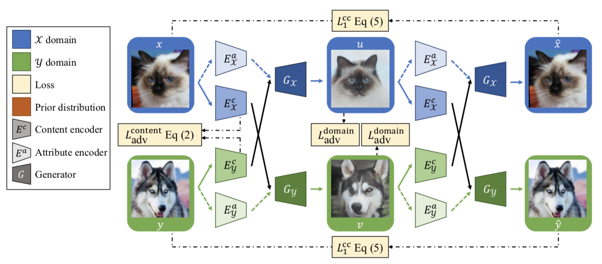

# DRIT-Tensorflow
Simple Tensorflow implementation of Diverse Image-to-Image Translation via Disentangled Representations (ECCV 2018 Oral)

## Requirements
* Tensorflow 1.8
* python 3.6

## Usage
### Download Dataset
* [cat2dog](http://vllab.ucmerced.edu/hylee/DRIT/datasets/cat2dog)
* [portrait](http://vllab.ucmerced.edu/hylee/DRIT/datasets/portrait)
* [CycleGAN](https://people.eecs.berkeley.edu/~taesung_park/CycleGAN/datasets/)
  
### Train
* python main.py --phase train --dataset cat2dog --concat True

### Test
* python main.py --phase test --dataset cat2dog --concat True

### Tips
* --concat
  * `True` : for the **shape variation translation** (e.g., cat <-> dog)
  * `False` : for the **shape preserving translation** (winter <-> summer)
  
* --n_scale
  * Using the `n_scale > 1`, a.k.a. `multiscale discriminator` often gets better results
  * recommend `n_scale = 3`
  
* --n_dis
  * If you don't use multi-discriminator, then recommend `n_dis = 6`
  
* --n_d_con
  * Model can still generate diverse results with `n_d_con = 1`

## Summary
### Comparison

### Train phase

### Test phase

## Author
Junho Kim
